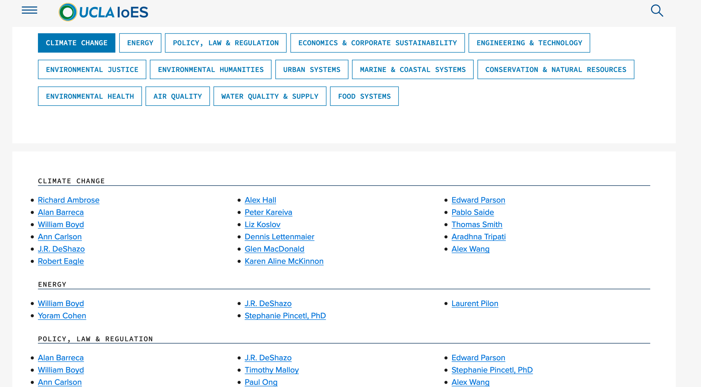
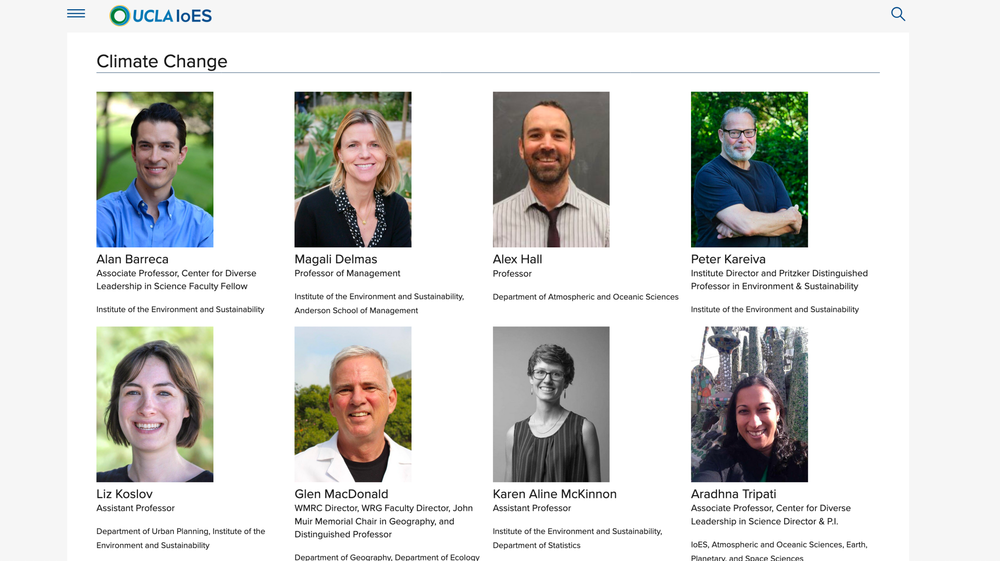
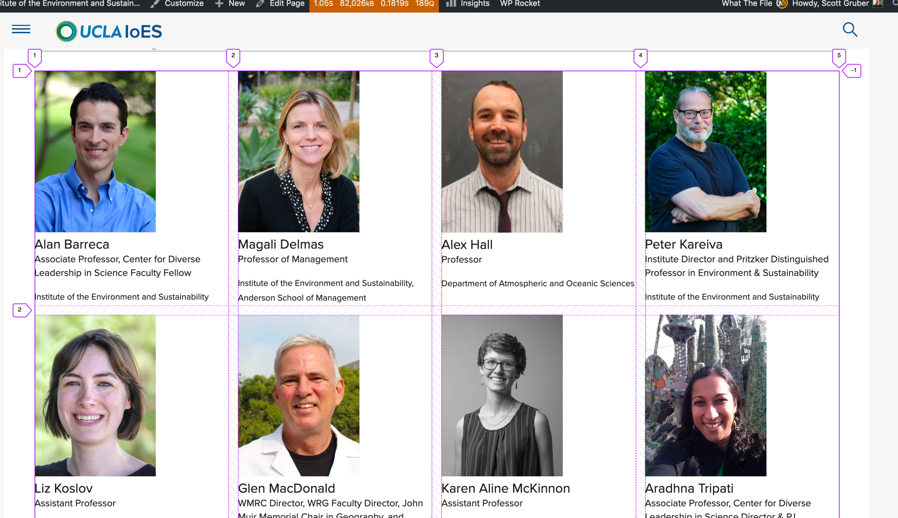
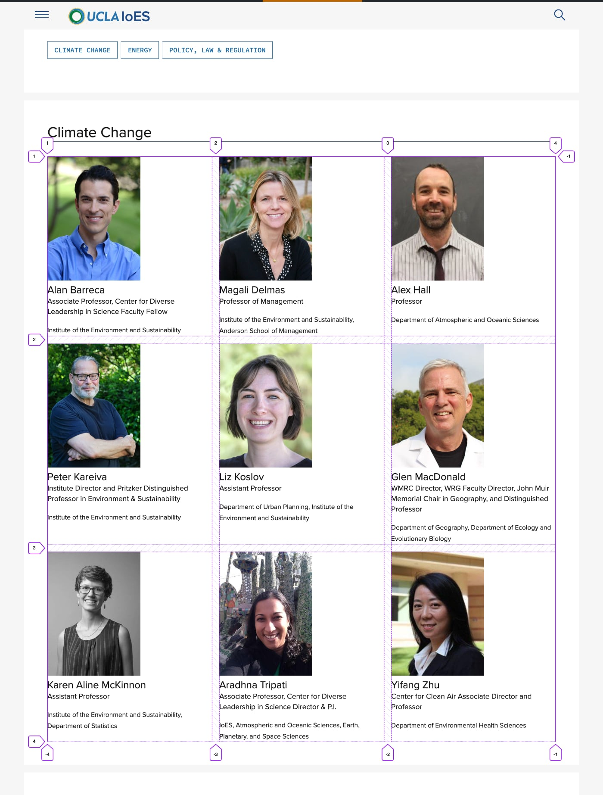
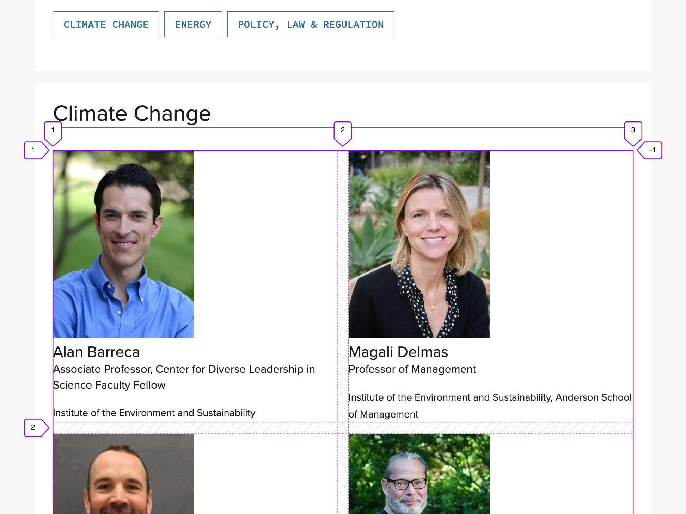
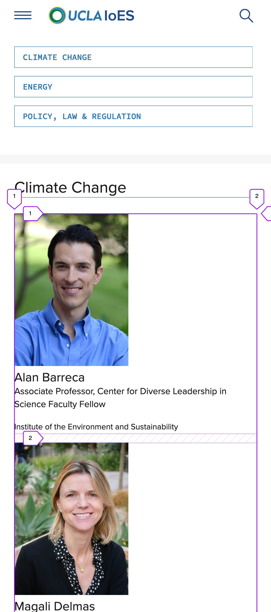

footer: [speaking.scottgruber.me](https://speaking.scottgruber.me) @ UC Tech Santa Barbara 2019

# [fit] Web Tools


^ How do you build websites? 

---
# What is in your toolkit?

---


^ 20+ years building websites

---


---


---


---


---

# [fit] What is the nature of the web?
^ what are the foundations. what doesn't change?

--- 


---


---


--- 
# What's else?

---
# [fit] A11Y

^ accessible, performance, aesthetics

--- 

# [fit] UX

^ work for everyone, loads fast, looks good.

--- 

# [fit] Design Systems  

---

# [fit] HTML & CSS
Flexbox, multi-column layout and CSS Grid
Microformats and semantic markup

---
[.hide-footer]



---

```html

<nav class="ucla-c-topic-nav">
<ul>
	<li><a href="#climate-change">Climate Change</a></li>
	<li><a href="#energy">Energy</a></li>
	<li><a href="#policy-law-regulation">Policy, Law &amp; Regulation</a></li>
	<li><a href="#economics-corporate-sustainability">Economics &amp; Corporate Sustainability</a></li>
</ul>
</nav>
```
---
# [fit] Flexbox

---

```css

.ucla-c-topic-nav ul {
    display: flex;
    flex-direction: column;
    list-style: none;
}

@media screen and (min-width: 30em) {
  .ucla-c-topic-nav ul {
    display: flex;
    flex-direction: row;
    flex-wrap: wrap;
  }
} 
```

---

[.hide-footer]


---


```html

<h2><a id="climate-change"></a>Climate Change</h2>

<div class="ucla-c-faculty-advisors">

<ul>	
  <li><a href="#">Alan Barreca</a></li>	
  <li><a href="#">Alex Hall</a></li>
  <li><a href="#">Peter Kareiva</a></li>
  <li><a href="#">Liz Koslov</a></li>
</ul>

</div>

```
---
# [fit] Multi-Column

---

```css

@media screen and (min-width: 30em) {
  .ucla-c-faculty-advisors > ul {
    column-count: 3;
    column-gap: 1em;
  }
}

@media screen and (min-width: 60em) {
  .ucla-c-faculty-advisors > ul {
    column-count: 5;
    column-gap: 1em;
  }
}

```

---

[.hide-footer]



---

# [fit] Microformats and HTML5
---

```html

<div class="ucla-c-people-grid">

<article class="h-card">
  <a class="u-url" href="#">
    <h2 class="fn p-name">Jane Kitty Doe</h2>
    
    <p class="p-job-title">Assistant Professor</p>
    <small class="p-org">Institute of the Environment and Sustainability</small>
  </a>
</article>

<article class="h-card">
    ...
</article>
</div>
```
---

```html

<div class="ucla-c-people-grid">

<article class="h-card">
  <a class="u-url" href="#">
    <figure>
      
      <figcaption>
        <h2 class="fn p-name">Kitty Doe</h2>
        <p class="p-job-title">Assistant Professor</p>
        <small class="p-org">Institute of the Environment and Sustainability</small>
      </figcaption>
    </figure>
  </a>
  </article>

</div>

```
---
#[fit]CSS Grid

---

[.hide-footer]


---
[.hide-footer]


---

[.hide-footer]


---
[.hide-footer]


---
#[fit]RWD
^ responsive by default with no media queries

---


```css

.ucla-c-people-grid {
  display: grid;
  grid-gap: 2vw;
  grid-template-columns: repeat(auto-fit, minmax(300px, 1fr));
  grid-template-rows: auto;
}

```

---

```css

/* fall back if no grid support */
.ucla-c-people-grid > article {
    display: inline-block;
    margin: 1em;
    vertical-align: top;
    width: 300px;
}

.ucla-c-people-grid > img {
    height: auto;
    width: 200px;
}

```
---

```css

@supports (display: grid) {

    .ucla-c-people-grid {
        display: grid;
        grid-gap: 2vw;
        grid-template-columns: repeat(auto-fit, minmax(300px, 1fr));
        grid-template-rows: auto;
    }

    /* reset properties */
    .ucla-c-people-grid > article {
        margin: initial;
        width: initial;
    }
}

```
---

# [fit] What's next?
--- 


#[fit] Art Direction for the Web.
Thank you. 

